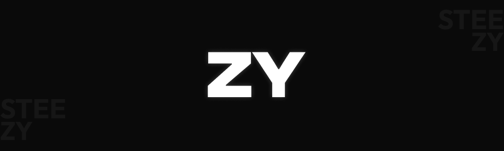

  
  
  
  

# ZY

ZY was designed to be a digital gallery/portfolio of projects created under the name of ZY. The main purpose of the website is to display the projects and other works done by ZY. Only 3 sections are available right now: Projects, Blog and About. The website is being constantly update with new content and additional feature. The content is being managed with Strapi CMS which is hosted by Heroku.
