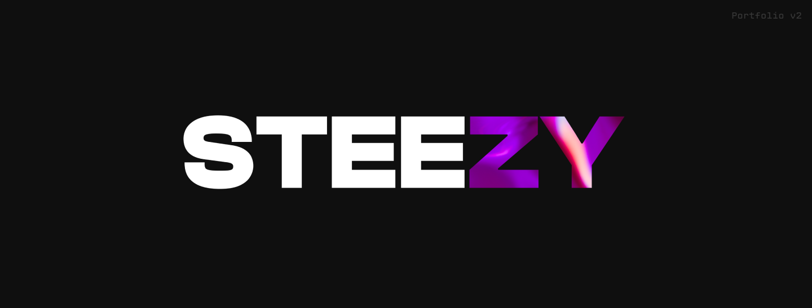

  
  
  
  

# ZY Digital gallery ~ Portfolio

ZY Digital Gallery ~ Portfolio is a web application for displaying programming and design projects of the author. It is created with Next.js and has the following sections: Projects, Blog, and About. The Projects section showcases the author's projects, while the Blog section contains articles written by the author, and the About section provides information about the author.

## Getting Started

To set up and run the ZY Digital Gallery ~ Portfolio, follow the instructions below:

1. Clone the repository to your local machine.
2. Install the required dependencies by running `yarn install`.
3. Start the development server by running `yarn run dev`.

The application will be accessible at http://localhost:3000.

## Project Structure

The project is structured as a yarn monorepo

- `app` - Next.js front-end dApp
- `cms` - Strapi CMS backend
